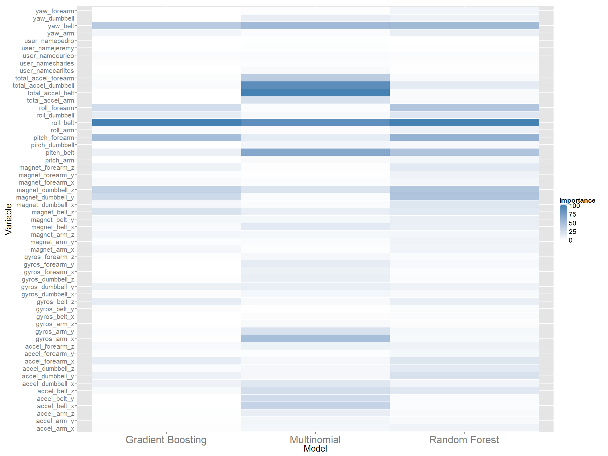

# Weight Lifting Exercise Analysis
Edwin Ng  
Sunday, August 9, 2015  
  
##Introduction
  Using devices such as Jawbone Up, Nike FuelBand, and Fitbit it is now possible to collect a large amount of data about personal activity relatively inexpensively. These type of devices are part of the quantified self movement. These types of quantitative analysis are getting more and more popular.  

In this case, we asked 6 participants to perform barbell lifts correctly and incorrectly in 5 different ways.  The original data source and more information can be found from the website below.

http://groupware.les.inf.puc-rio.br/har.  

We can also download the training data for this analysis here:

https://d396qusza40orc.cloudfront.net/predmachlearn/pml-training.csv

The test data are available here:

https://d396qusza40orc.cloudfront.net/predmachlearn/pml-testing.csv

##Data Cleaning 
Let's load the libraries needed...

```r
library(dplyr)
library(tidyr)
library(ggplot2)
library(caret)
library(parallel)
```
Here we simply throw away all the columns containing at least one missing values. Also, we throw away some data that is not qualified as features such as the record time, sample identity number etc.


```r
# setwd('C:\\Users\\edng\\Desktop\\Practical Machine Learning\\Project')
setwd('C:\\Users\\Edwin\\Desktop\\Edwin(10-08-2012)\\Assignments and Modules\\Coursera\\Practical Machine Learning\\Project')

training.raw <- read.csv('pml-training.csv', na.strings = c("NA", "", "#DIV/0!"))
testing.raw <- read.csv('pml-testing.csv', na.strings = c("NA", "", "#DIV/0!"))

training.clean <- training.raw[ , colSums(is.na(training.raw)) == 0 &  
                                  !names(training.raw) %in% c('X','raw_timestamp_part_1','raw_timestamp_part_2', 'cvtd_timestamp',
                                                             'new_window', 'num_window')]

testing.clean  <- testing.raw[ , colSums(is.na(testing.raw)) == 0 &  
                                 !names(training.raw) %in% c('X','raw_timestamp_part_1','raw_timestamp_part_2', 'cvtd_timestamp',
                                                             'new_window', 'num_window')]
```

##Exploratory Analysis

It is worth doing some exploratory analysis on the data. We first extracted the numerical variables and normalize it.  So we substract the mean and divide the result by the standard deviation within each variable.  Then we can compare the mean of each group of each feature with the across group mean.


```r
training.clean.numeric <- cbind(training.clean$classe, training.clean[, sapply(training.clean, is.numeric)])
names(training.clean.numeric)[1] <- 'classe'

training.clean.melt <- training.clean.numeric %>% 
  gather("variable", "value", 2:ncol(training.clean.numeric))

training.clean.global.averages <- training.clean.melt %>%
  group_by(variable) %>% dplyr::summarise(global.mean = mean(value), global.sd = sd(value))

training.clean.classe.averages <- training.clean.melt %>%
  group_by(classe, variable) %>% dplyr::summarise(classe.averages = mean(value))

training.clean.classe.plot.data <- training.clean.classe.averages %>%
  inner_join(training.clean.global.averages, by = 'variable') %>% mutate(normalized.averages = (classe.averages - global.mean)/global.sd)


yaw.roll.belt.plot <- ggplot(data = training.clean) + 
  geom_point(mapping = aes(y = yaw_belt, x = roll_belt, colour = classe)) + 
   theme(text  = element_text(size = 20)) + scale_colour_discrete(guide = guide_legend(title = 'Class'))

yaw.roll.belt.plot2 <- ggplot(data = training.clean) + 
  geom_point(mapping = aes(y = yaw_belt, x = roll_belt, colour = user_name)) +
    theme(text  = element_text(size = 20)) + scale_colour_discrete(guide = guide_legend(title = 'User'))

classe.variable.plot <- ggplot(data = training.clean.classe.plot.data) + 
  geom_tile(mapping = aes(fill = normalized.averages, y = variable, x = classe), colour = "white") + 
  scale_fill_gradient(guide = guide_legend(title = 'Normalized Class Averages'), 
                      low = "#FF5F5F", high = "#A3FF75") +  theme(text  = element_text(size = 20),
                                                                  axis.text.x = element_text(size  = 25)) +
  labs(x = 'Class', y = 'Variable', title = 'Normalized Class Variable Averages')
```
We can see that there are some classes with quite a different mean such as __pitch_foream__ in class __A__ and __roll_dumbbell__ in group __C__ etc.


```r
classe.variable.plot
```

 
We also plotted different variables against each other.  Here are one of the important variables plot:

```r
yaw.roll.belt.plot
```

 

We can notice that there are also some interaction effects between variables.


```r
yaw.roll.belt.plot2
```

 
##Data Split

Now, we split the data into training(80%) and validation(20%).


```r
set.seed(1234)
split20 <- createDataPartition(training.clean$classe, p = 0.2, list = FALSE)

train80 <- training.clean[-split20,]
valid20 <- training.clean[split20,]
```

##Model Training

We introduce three types of model:
1. Random Forest
2. Multi-nomial Regression
3. Gradient Boosting


```r
my.trainControl <- trainControl(method = "cv", number = 3, allowParallel = TRUE)

start.time <- Sys.time()
modFit.rf       <- train(classe ~., data = train80, method = 'rf', trControl = my.trainControl)
rf.train.time <- Sys.time()
rf.time.elapsed <- difftime(rf.train.time, start.time, unit = 'mins')

start.time <- Sys.time()
modFit.multinom <- train(classe ~., data = train80, method = 'multinom', trControl = my.trainControl)
multi.train.time <- Sys.time()
multi.time.elapsed <- difftime(multi.train.time, start.time, unit = 'mins')

start.time <- Sys.time()
modFit.gbm      <- train(classe ~ ., data = train80, method = 'gbm', trControl = my.trainControl)
gbm.train.time <- Sys.time()
gbm.time.elapsed <- difftime(gbm.train.time, start.time, unit = 'mins')
```


```r
rf.time.elapsed
```

```
## Time difference of 6.403534 mins
```

```r
multi.time.elapsed
```

```
## Time difference of 1.257863 mins
```

```r
gbm.time.elapsed
```

```
## Time difference of 2.691315 mins
```


```r
varImp.rf        <- varImp(modFit.rf)$importance
varImp.rf$Variable <- row.names(varImp.rf)
row.names(varImp.rf) <- NULL
names(varImp.rf) <- c('Importance','Variable')
varImp.rf <- varImp.rf[,c(2,1)]
varImp.rf <- varImp.rf[order(varImp.rf$Importance, decreasing = FALSE), ]
varImp.rf$Model <- 'Random Forest'
# varImp.rf$Variable <- factor(varImp.rf$Variable, levels = unique(varImp.rf$Variable))

varImp.multinom        <- varImp(modFit.multinom)$importance
varImp.multinom$Variable <- row.names(varImp.multinom)
row.names(varImp.multinom) <- NULL
names(varImp.multinom) <- c('Importance','Variable')
varImp.multinom <- varImp.multinom[,c(2,1)]
varImp.multinom <- varImp.multinom[order(varImp.multinom$Importance, decreasing = FALSE), ]
varImp.multinom$Model <- 'Multinomial'
# varImp.multinom$Variable <- factor(varImp.multinom$Variable, levels = unique(varImp.multinom$Variable))

varImp.gbm       <- varImp(modFit.gbm)$importance
varImp.gbm$Variable <- row.names(varImp.gbm)
row.names(varImp.gbm) <- NULL
names(varImp.gbm) <- c('Importance','Variable')
varImp.gbm <- varImp.gbm[,c(2,1)]
varImp.gbm <- varImp.gbm[order(varImp.gbm$Importance, decreasing = FALSE), ]
varImp.gbm$Model <- 'Gradient Boosting' 
# varImp.gbm$Variable <- factor(varImp.gbm$Variable, levels = unique(varImp.gbm$Variable))

varImp.Comb <- rbind(varImp.rf, varImp.multinom, varImp.gbm)

varImp.plot <- ggplot(data = varImp.Comb) + 
  geom_tile(mapping = aes(fill = Importance, y = Variable, x = Model), colour = "white") + 
  scale_fill_gradient(low = "white", high = "steelblue") +  theme(text  = element_text(size = 20),
                                                                  axis.text.x = element_text(size  = 25))
varImp.plot
```

 

