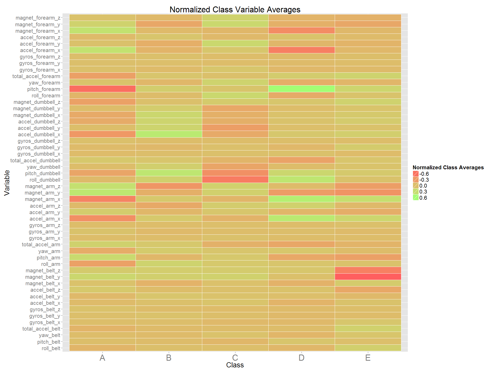
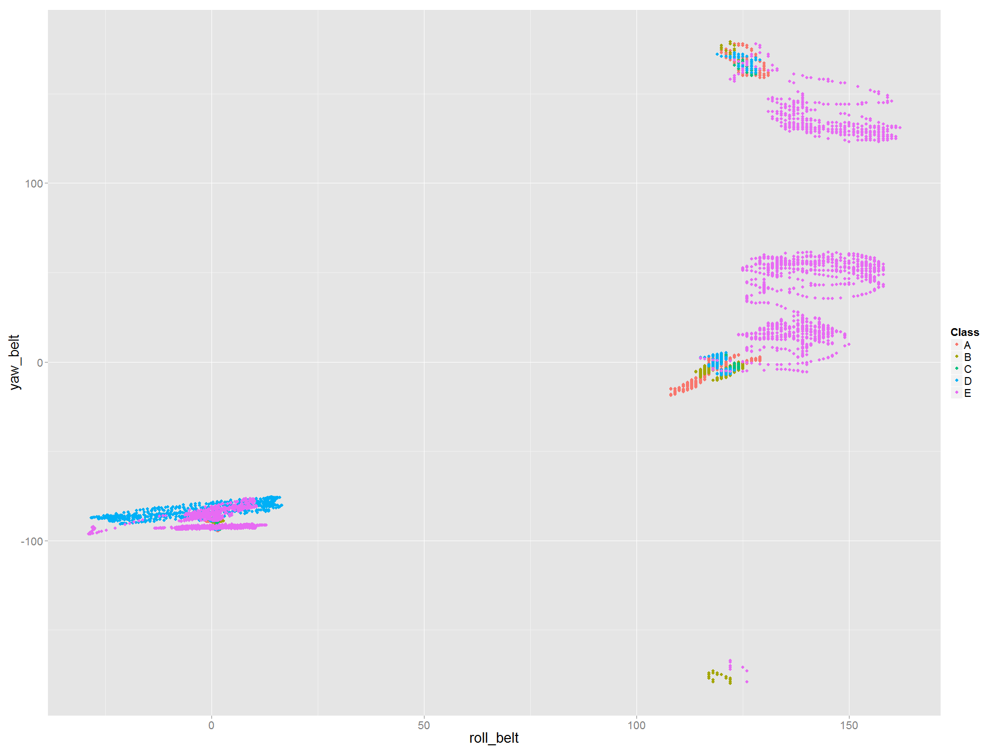
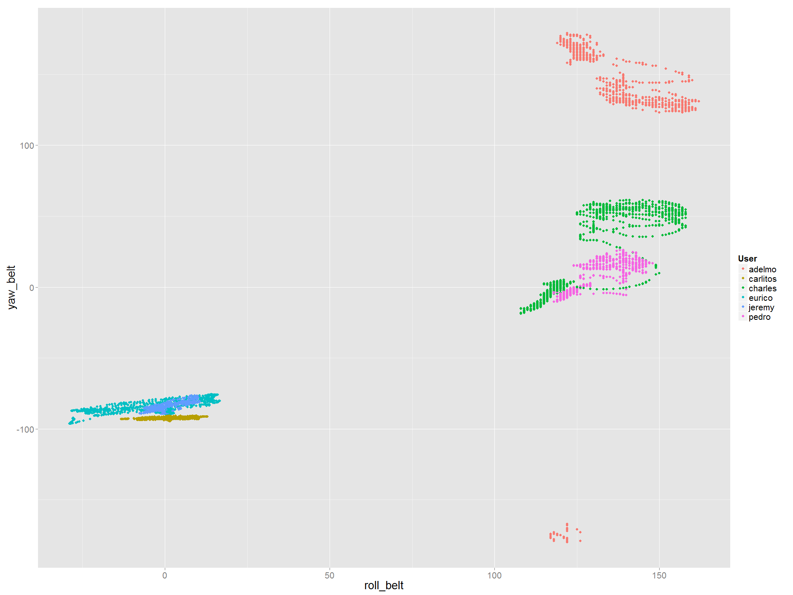
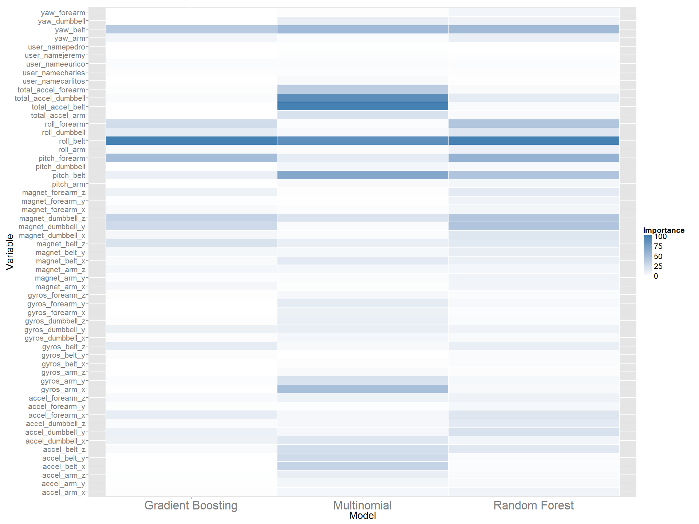

# Weight Lifting Exercise Analysis
Edwin Ng  
Sunday, August 9, 2015  
  
##Introduction
  Nowadays, we can use devices such as Jawbone Up, Nike FuelBand, and Fitbit to collect a large amount of data about personal activity relatively inexpensively. These type of devices are part of the quantified self movement. These types of quantitative analysis are getting more and more popular.  

In this project, we perform analysis from the data source from http://groupware.les.inf.puc-rio.br/har. which asked 6 participants to perform barbell lifts correctly and incorrectly in 5 different ways.  The original data source and more information can be found from the website below.

We can also download the training data for this analysis here:

https://d396qusza40orc.cloudfront.net/predmachlearn/pml-training.csv

The test data are available here:

https://d396qusza40orc.cloudfront.net/predmachlearn/pml-testing.csv

##Data Cleaning 
Let's load the libraries needed...

```r
library(dplyr)
library(tidyr)
library(ggplot2)
library(caret)
library(parallel)
```
Here we simply throw away all the columns containing at least one missing values. Also, we throw away some data that is not qualified as features such as the record time, sample identity number etc.


```r
# setwd('C:\\Users\\edng\\Desktop\\Practical Machine Learning\\Project')
setwd('C:\\Users\\Edwin\\Desktop\\Edwin(10-08-2012)\\Assignments and Modules\\Coursera\\Practical Machine Learning\\Project')

training.raw <- read.csv('https://d396qusza40orc.cloudfront.net/predmachlearn/pml-training.csv
', na.strings = c("NA", "", "#DIV/0!"))
testing.raw <- read.csv('https://d396qusza40orc.cloudfront.net/predmachlearn/pml-testing.csv', na.strings = c("NA", "", "#DIV/0!"))

training.clean <- training.raw[ , colSums(is.na(training.raw)) == 0 &  
                                  !names(training.raw) %in% c('X','raw_timestamp_part_1','raw_timestamp_part_2', 'cvtd_timestamp',
                                                             'new_window', 'num_window')]

testing.clean  <- testing.raw[ , colSums(is.na(testing.raw)) == 0 &  
                                 !names(training.raw) %in% c('X','raw_timestamp_part_1','raw_timestamp_part_2', 'cvtd_timestamp',
                                                             'new_window', 'num_window')]
```

##Exploratory Analysis

It is worth doing some exploratory analysis on the data. We first extracted the numerical variables and normalize it.  So we subtract the mean and divide the result by the standard deviation within each variable.  Then we can compare the mean of each group of each feature with the across group mean.


```r
training.clean.numeric <- cbind(training.clean$classe, training.clean[, sapply(training.clean, is.numeric)])
names(training.clean.numeric)[1] <- 'classe'

training.clean.melt <- training.clean.numeric %>% 
  gather("variable", "value", 2:ncol(training.clean.numeric))

training.clean.global.averages <- training.clean.melt %>%
  group_by(variable) %>% dplyr::summarise(global.mean = mean(value), global.sd = sd(value))

training.clean.classe.averages <- training.clean.melt %>%
  group_by(classe, variable) %>% dplyr::summarise(classe.averages = mean(value))

training.clean.classe.plot.data <- training.clean.classe.averages %>%
  inner_join(training.clean.global.averages, by = 'variable') %>% mutate(normalized.averages = (classe.averages - global.mean)/global.sd)


yaw.roll.belt.plot <- ggplot(data = training.clean) + 
  geom_point(mapping = aes(y = yaw_belt, x = roll_belt, colour = classe)) + 
   theme(text  = element_text(size = 20)) + scale_colour_discrete(guide = guide_legend(title = 'Class'))

yaw.roll.belt.plot2 <- ggplot(data = training.clean) + 
  geom_point(mapping = aes(y = yaw_belt, x = roll_belt, colour = user_name)) +
    theme(text  = element_text(size = 20)) + scale_colour_discrete(guide = guide_legend(title = 'User'))

classe.variable.plot <- ggplot(data = training.clean.classe.plot.data) + 
  geom_tile(mapping = aes(fill = normalized.averages, y = variable, x = classe), colour = "white") + 
  scale_fill_gradient(guide = guide_legend(title = 'Normalized Class Averages'), 
                      low = "#FF5F5F", high = "#A3FF75") +  theme(text  = element_text(size = 20),
                                                                  axis.text.x = element_text(size  = 25)) +
  labs(x = 'Class', y = 'Variable', title = 'Normalized Class Variable Averages')
```
We can see that there are some classes with quite a different mean such as __pitch_foream__ in class __A__ and __roll_dumbbell__ in group __C__ etc.


```r
classe.variable.plot
```

 
We also plotted different variables against each other.  Here are one of the important variables plot:

```r
yaw.roll.belt.plot
```

 
We notice that interaction effects between variables are significant here since the regions are defined much better with multi-variables from above plot.  In those cases, we should expect algorithm such as __random forest__ will perform much better.

Below is a plot for the same set of variables grouped by users.


```r
yaw.roll.belt.plot2
```

 
##Data Split

To start with the modeling, we split the data into training(80%) and validation(20%).


```r
set.seed(1234)
split20 <- createDataPartition(training.clean$classe, p = 0.2, list = FALSE)

train80 <- training.clean[-split20,]
valid20 <- training.clean[split20,]
```

##Model Training

We introduce three types of model:

1. Random Forest
2. Multi-nominal Regression
3. Gradient Boosting


```r
rf.time.elapsed
```

```
## Time difference of 6.364802 mins
```

```r
multi.time.elapsed
```

```
## Time difference of 1.408899 mins
```

```r
gbm.time.elapsed
```

```
## Time difference of 2.804144 mins
```

Although we find random forest has the longest computation time, we will see later on it actually has the best performance.  Now, we first compare the variable importance in each model.


We can see that for most of the variables, __random forest__ agrees with __gradient boosting__ whereas __multi-nomial__ acts quite differently.  (To see the code, please look at __Appendix__)


```r
varImp.plot
```

 

##Model Validation/Conclusion

We can see that the accuracy is very high in __random forest__ with a quite close performance comparing to __gradient boosting__.   In case for some other practical reasons, we can also perform __principal component__ decomposition to extract higher valued variables or just simplay use the top 20 variables from the variable importance table. Anyhow, with 90%, such a high accuracy, we are satisfied to present the __random forest__ model as our final and it results in 100% accuracy with the testing cases(link provided in __Introduction__).

##Appendix 

### Training Code


```r
my.trainControl <- trainControl(method = "cv", number = 3, allowParallel = TRUE)

start.time <- Sys.time()
modFit.rf       <- train(classe ~., data = train80, method = 'rf', trControl = my.trainControl)
rf.train.time <- Sys.time()
rf.time.elapsed <- difftime(rf.train.time, start.time, unit = 'mins')

start.time <- Sys.time()
modFit.multinom <- train(classe ~., data = train80, method = 'multinom', trControl = my.trainControl)
multi.train.time <- Sys.time()
multi.time.elapsed <- difftime(multi.train.time, start.time, unit = 'mins')

start.time <- Sys.time()
modFit.gbm      <- train(classe ~ ., data = train80, method = 'gbm', trControl = my.trainControl)
gbm.train.time <- Sys.time()
gbm.time.elapsed <- difftime(gbm.train.time, start.time, unit = 'mins')
```

### Variable Importance Code


```r
varImp.rf        <- varImp(modFit.rf)$importance
varImp.rf$Variable <- row.names(varImp.rf)
row.names(varImp.rf) <- NULL
names(varImp.rf) <- c('Importance','Variable')
varImp.rf <- varImp.rf[,c(2,1)]
varImp.rf <- varImp.rf[order(varImp.rf$Importance, decreasing = FALSE), ]
varImp.rf$Model <- 'Random Forest'

varImp.multinom        <- varImp(modFit.multinom)$importance
varImp.multinom$Variable <- row.names(varImp.multinom)
row.names(varImp.multinom) <- NULL
names(varImp.multinom) <- c('Importance','Variable')
varImp.multinom <- varImp.multinom[,c(2,1)]
varImp.multinom <- varImp.multinom[order(varImp.multinom$Importance, decreasing = FALSE), ]
varImp.multinom$Model <- 'Multinomial'

varImp.gbm       <- varImp(modFit.gbm)$importance
varImp.gbm$Variable <- row.names(varImp.gbm)
row.names(varImp.gbm) <- NULL
names(varImp.gbm) <- c('Importance','Variable')
varImp.gbm <- varImp.gbm[,c(2,1)]
varImp.gbm <- varImp.gbm[order(varImp.gbm$Importance, decreasing = FALSE), ]
varImp.gbm$Model <- 'Gradient Boosting' 

varImp.Comb <- rbind(varImp.rf, varImp.multinom, varImp.gbm)

varImp.plot <- ggplot(data = varImp.Comb) + 
  geom_tile(mapping = aes(fill = Importance, y = Variable, x = Model), colour = "white") + 
  scale_fill_gradient(low = "white", high = "steelblue") +  theme(text  = element_text(size = 20),
                                                                  axis.text.x = element_text(size  = 25))
```

### Model Result


```r
pred.rf       <- predict(object = modFit.rf, newdata = valid20)
pred.multinom <- predict(object = modFit.multinom, newdata = valid20)
pred.gbm      <- predict(object = modFit.gbm, newdata = valid20)

confusionMatrix(pred.rf, valid20$classe)
```

```
## Confusion Matrix and Statistics
## 
##           Reference
## Prediction    A    B    C    D    E
##          A 1116    3    0    0    0
##          B    0  754    2    0    1
##          C    0    3  679    7    2
##          D    0    0    4  637    3
##          E    0    0    0    0  716
## 
## Overall Statistics
##                                           
##                Accuracy : 0.9936          
##                  95% CI : (0.9906, 0.9959)
##     No Information Rate : 0.2842          
##     P-Value [Acc > NIR] : < 2.2e-16       
##                                           
##                   Kappa : 0.9919          
##  Mcnemar's Test P-Value : NA              
## 
## Statistics by Class:
## 
##                      Class: A Class: B Class: C Class: D Class: E
## Sensitivity            1.0000   0.9921   0.9912   0.9891   0.9917
## Specificity            0.9989   0.9991   0.9963   0.9979   1.0000
## Pos Pred Value         0.9973   0.9960   0.9826   0.9891   1.0000
## Neg Pred Value         1.0000   0.9981   0.9981   0.9979   0.9981
## Prevalence             0.2842   0.1935   0.1744   0.1640   0.1839
## Detection Rate         0.2842   0.1920   0.1729   0.1622   0.1823
## Detection Prevalence   0.2850   0.1928   0.1760   0.1640   0.1823
## Balanced Accuracy      0.9995   0.9956   0.9938   0.9935   0.9958
```

```r
confusionMatrix(pred.multinom, valid20$classe)
```

```
## Confusion Matrix and Statistics
## 
##           Reference
## Prediction   A   B   C   D   E
##          A 967 131 133  66  49
##          B  39 386  61  23  74
##          C  48  94 412 128  71
##          D  47  50  36 398  76
##          E  15  99  43  29 452
## 
## Overall Statistics
##                                           
##                Accuracy : 0.6659          
##                  95% CI : (0.6509, 0.6807)
##     No Information Rate : 0.2842          
##     P-Value [Acc > NIR] : < 2.2e-16       
##                                           
##                   Kappa : 0.5745          
##  Mcnemar's Test P-Value : < 2.2e-16       
## 
## Statistics by Class:
## 
##                      Class: A Class: B Class: C Class: D Class: E
## Sensitivity            0.8665  0.50789   0.6015   0.6180   0.6260
## Specificity            0.8652  0.93780   0.8948   0.9363   0.9420
## Pos Pred Value         0.7184  0.66209   0.5471   0.6557   0.7085
## Neg Pred Value         0.9423  0.88816   0.9140   0.9259   0.9179
## Prevalence             0.2842  0.19353   0.1744   0.1640   0.1839
## Detection Rate         0.2462  0.09829   0.1049   0.1013   0.1151
## Detection Prevalence   0.3428  0.14846   0.1917   0.1546   0.1625
## Balanced Accuracy      0.8658  0.72285   0.7481   0.7772   0.7840
```

```r
confusionMatrix(pred.gbm, valid20$classe)
```

```
## Confusion Matrix and Statistics
## 
##           Reference
## Prediction    A    B    C    D    E
##          A 1095   20    0    1    2
##          B   14  718   31    1    4
##          C    3   19  643   22    4
##          D    4    1   11  614   11
##          E    0    2    0    6  701
## 
## Overall Statistics
##                                           
##                Accuracy : 0.9603          
##                  95% CI : (0.9537, 0.9662)
##     No Information Rate : 0.2842          
##     P-Value [Acc > NIR] : < 2e-16         
##                                           
##                   Kappa : 0.9498          
##  Mcnemar's Test P-Value : 0.02452         
## 
## Statistics by Class:
## 
##                      Class: A Class: B Class: C Class: D Class: E
## Sensitivity            0.9812   0.9447   0.9387   0.9534   0.9709
## Specificity            0.9918   0.9842   0.9852   0.9918   0.9975
## Pos Pred Value         0.9794   0.9349   0.9305   0.9579   0.9887
## Neg Pred Value         0.9925   0.9867   0.9870   0.9909   0.9935
## Prevalence             0.2842   0.1935   0.1744   0.1640   0.1839
## Detection Rate         0.2788   0.1828   0.1637   0.1564   0.1785
## Detection Prevalence   0.2847   0.1956   0.1760   0.1632   0.1805
## Balanced Accuracy      0.9865   0.9645   0.9619   0.9726   0.9842
```
